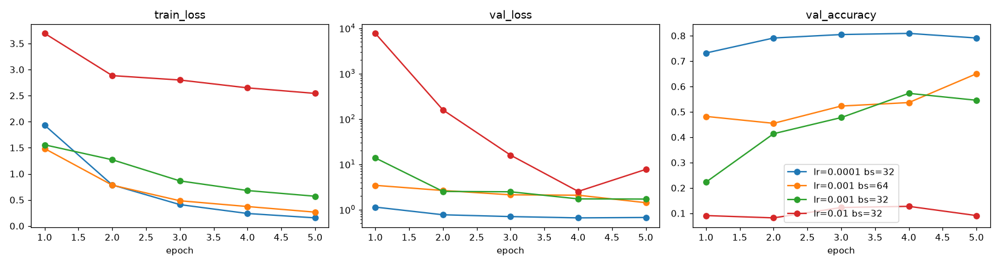

# Lab 2 - Model training and experiment tracking with MLflow

## What was done

| Step | Where |
|---|---|
| Training libraries (`mlflow torch torchvision scikit-learn`) | `pyproject.toml`, `uv.lock` |
| Local tracking server (`sqlite:///mlflow.db`, artifacts in `./mlruns`) | run from repo root, port 5000 |
| `mlflow.db` / `mlruns/` ignored | `.gitignore` |
| Training script with MLflow tracking | [`src/food11/train.py`](src/food11/train.py) |
| ImageFolder datasets (`food11_processed`, `food11_processed_mini`) | `imagefolders` stage in `dvc.yaml`, [`src/build_imagefolders.py`](src/build_imagefolders.py) |
| 4 comparison runs | [`reports/lab2/runs.csv`](reports/lab2/runs.csv), [`reports/lab2/metrics.png`](reports/lab2/metrics.png) |

**About the dataset:** in Lab 1 the raw Food-11 images stayed in flat folders
(`<classid>_<idx>.jpg`), and "processed" meant CSV files listing the train/val/test
splits. `torchvision.datasets.ImageFolder` needs one folder per class, so a new DVC stage
turns those CSVs into:

```
processed/food11_processed/{train,val,test}/<class>/*.jpg        9866 / 3430 / 3347 images
processed/food11_processed_mini/{train,val,test}/<class>/*.jpg   50 / 20 / 20 per class (550 / 220 / 220)
```

Files are hard-linked where possible, so they take no extra disk space in the workspace.
Both folders are DVC outputs.

**What `train.py` does:** loads data with `ImageFolder` and `DataLoader`. Starts from an
ImageNet-pretrained `resnet18` and replaces `fc` with `Linear(512, 11)`. Fine-tunes all
layers with Adam and cross-entropy loss. Takes `--dataset {processed,mini}`, `--epochs`,
`--lr` and `--batch-size` as arguments. Inside `mlflow.start_run()` it logs:
- the params once, at the start
- `train_loss`, `val_loss` and `val_accuracy` every epoch (`step=epoch`)
- `test_accuracy` and the model (`mlflow.pytorch.log_model`) at the end

MLflow 3 saves PyTorch models in the `pt2` (`torch.export`) format by default. That
format needs an `input_example`, so the script passes one test image.

### Runs (experiment `food11`, mini dataset, 5 epochs, sorted by `val_accuracy`)

| run_id | lr | batch_size | train_loss | val_loss | val_accuracy | test_accuracy |
|---|---|---|---|---|---|---|
| **`cc8c24cb83d5496db3e15c4bb0091fa0`** | **0.0001** | **32** | 0.155 | 0.670 | **0.791** | **0.827** |
| `ed6a7111b61d46c59e6d09b7968b4775` | 0.001 | 64 | 0.265 | 1.419 | 0.650 | 0.695 |
| `ee49c45fab774f1c88671fac348ceccf` | 0.001 | 32 | 0.570 | 1.705 | 0.545 | 0.605 |
| `03b7dd5fbc474e8ebeeed6d10adbab07` | 0.01 | 32 | 2.542 | 7.699 | 0.091 | 0.118 |



The table shows the last-epoch value of each metric. I made the chart from the MLflow
metric history (`MlflowClient.get_metric_history`), and it shows the same curves as the
UI's compare view. My first attempts crashed while logging the model (because of the
`input_example` issue above). Those broken runs were deleted from the experiment.

---

## Answers

### Question 1 - What changed in `pyproject.toml` and `uv.lock`?

Nothing. `uv add mlflow torch torchvision scikit-learn` only printed
`Resolved 200 packages` / `Checked 180 packages`, and `git diff` was empty. All four
packages were already dependencies from Lab 1, which used torch/torchvision for training,
mlflow for DagsHub tracking and scikit-learn for evaluation.

If they had been new, `uv add` would have:
- added them to `[project].dependencies` in `pyproject.toml` with a minimum version
  (for example `mlflow>=3.x`)
- added the exact resolved version, source URL and hashes of each package *and all of
  its transitive dependencies* to `uv.lock` (mlflow alone pulls in dozens: flask,
  sqlalchemy, alembic, pandas, ...)

`pyproject.toml` says what we want. `uv.lock` records exactly what was installed, so
`uv sync` gives the same environment on any machine. torch/torchvision keep coming from
the `pytorch-cu128` index set up in Lab 1, because this machine has an NVIDIA RTX 5060
and the CUDA build is useful here.

### Question 2 - `--backend-store-uri` vs `--default-artifact-root`

- `--backend-store-uri sqlite:///mlflow.db` is where MLflow keeps its **metadata**:
  experiments, runs (status, start/end time, run name), params, metrics with their full
  step history, tags, and the records of logged models. This goes in a database, here the
  SQLite file `mlflow.db`. The UI queries it to list, sort, filter and compare runs.
- `--default-artifact-root ./mlruns` is where the **artifacts** of new experiments go.
  Artifacts are files: the saved model (`MLmodel`, `data/model.pt2`, `requirements.txt`,
  `conda.yaml`, input example), plus any plots or other files you log. Experiment
  `food11` got the artifact location `mlruns/1`.

The difference: metadata is small, structured data that MLflow needs to search and plot
(one number per param or metric step), so it lives in a database. Artifacts are opaque
files that can be large (each resnet18 model here is about 51 MB). MLflow just stores and
serves them, so they live on a filesystem or object store (a local folder here; S3, GCS
or Azure Blob in production). The two can be scaled and placed separately.

### Question 3 - Why not track `mlflow.db` / `mlruns/` with git or dvc?

**Not git:**
- they are generated run outputs, not source code
- `mlflow.db` is a binary SQLite file: git can't diff or merge it, and every run would
  commit a new copy of the whole database
- `mlruns/` holds large binary model files (about 51 MB per run) that would bloat the repo
  history forever
- the contents are machine-specific: artifact locations are absolute paths like
  `file:C:/Users/Admin/Desktop/MLOPS/mlops-lab-1/mlruns/1`
- two people committing their own `mlflow.db` would always conflict

**Not dvc either:** DVC versions *inputs and outputs* (datasets, models of a pipeline) so
that a past state can be checked out and reproduced. MLflow's store is something else: an
**append-only log of every experiment**, which MLflow manages itself, with its own IDs and
references between the db and the artifact folders.
- A DVC snapshot of it would be out of date as soon as the next run is logged.
- Doing `dvc checkout` of an older version would *delete* the runs logged since then.
- The server keeps `mlflow.db` open while it runs, so hashing or replacing it under the
  server is unsafe.

The history is already in MLflow, which is where you browse it. To share it, point
everyone at one shared tracking server (as with DagsHub in Lab 1) instead of copying files
around. The code is versioned in git, the data in dvc, and the run results in MLflow.

### Question 4 - First call to `set_experiment` with a new name

If no experiment called `food11` exists, MLflow **creates it** and makes it the active
experiment. It logs `Experiment with name 'food11' does not exist. Creating a new
experiment.` In the UI a new experiment `food11` appears next to `Default`, with ID `1`
(Default is `0`) and artifact location `mlruns/1`. On later calls the experiment already
exists, so `set_experiment` just selects it and new runs are added to it.

### Question 5 - `log_param` vs `log_metric`, and why only metrics take `step`

- A **param** is an *input* to the run, chosen before training and fixed for its whole
  duration: `lr`, `batch_size`, `epochs`, `dataset`, `model`. It is stored as a single
  string value per key. Logging the same key again with a different value raises an error,
  because a run can't have two learning rates.
- A **metric** is a numeric *output* that is measured and can change during training:
  `train_loss`, `val_loss`, `val_accuracy`, `test_accuracy`. MLflow keeps **every logged
  value** as a history of `(value, step, timestamp)` entries, not just the latest one.

`step` is the x-axis of that history. It says which point in training the value belongs to
(here the epoch). That is what lets the UI draw learning curves and compare runs
epoch-by-epoch. A param has only one value for the whole run, so there is nothing to put
on an axis and `log_param` has no `step`.

### Question 6 - Params, metric charts, model artifact; where is the model on disk?

On a run's page in the UI:
- **Overview** shows the params table (`batch_size`, `dataset`, `epochs`, `lr`, `model`,
  `optimizer`, `seed`) and the latest metric values.
- **Model metrics** shows the per-epoch charts of `train_loss`, `val_loss` and
  `val_accuracy`, plus `test_accuracy`, which is a single point.
- **Artifacts / Logged models** shows the model `model` (`MLmodel`, `data/model.pt2`,
  `conda.yaml`, `python_env.yaml`, `requirements.txt`, `input_example.json`,
  `serving_input_example.json`).

On disk, the artifacts are in the `--default-artifact-root` folder, **not** in `mlflow.db`.
The database only stores the model's URI. MLflow 3 treats logged models as their own
entities, so they are stored under the experiment's `models/` folder, keyed by model ID
rather than run ID. For the best run:

```
mlruns/1/models/m-d497a61db8264802801ae82eee056ed0/artifacts/
├── MLmodel
├── data/model.pt2        # the exported weights + graph (~51 MB)
├── conda.yaml / python_env.yaml / requirements.txt
└── input_example.json / serving_input_example.json
```

The artifact root is a plain local path. Because of that, the *training script itself*
writes these files straight to the filesystem (relative to where it runs, which is the
repo root). They don't go through the server over HTTP.

### Question 7 - Which learning rate gave the best `val_accuracy`? Is higher always better?

**lr = 0.0001** (batch 32): `val_accuracy` 0.791 at the last epoch (peak 0.809 at epoch 4),
`test_accuracy` 0.827. **Higher is not better.** The ranking is exactly the reverse of the
learning rate:

| lr (batch 32) | val_accuracy |
|---|---|
| 0.0001 | 0.791 |
| 0.001 | 0.545 |
| 0.01 | 0.091 |

At lr = 0.01 training **diverged**. `val_loss` hit about 7700 after the first epoch and
accuracy stayed at 0.09, which is chance level for 11 classes (1/11 ≈ 0.091), meaning the
model predicts a single class. The reason: we are *fine-tuning a pretrained network*. Its
ImageNet weights are already a good starting point, and large Adam steps wipe out those
features instead of adjusting them. lr = 0.001 still learns, but its `val_loss` is noisy
and high (13.8 after epoch 1). lr = 0.0001 is above 0.73 after only one epoch. A learning
rate can also be *too* small (training becomes very slow and underfits in a fixed number
of epochs), so the right value has to be found by experiment, which is what this
comparison does.

### Question 8 - Parallel coordinates plot (`lr`, `batch_size`, `val_accuracy`)

- **The learning rate dominates.** Lines going through lower `lr` values end at higher
  `val_accuracy`. The lr = 0.0001 line is at the top and the lr = 0.01 line at the bottom.
  None of the lines cross between the `lr` and `val_accuracy` axes, so the relationship is
  monotonic in this range.
- **Batch size matters less.** At the same lr = 0.001, batch 64 got 0.650 and batch 32 got
  0.545. That fits the idea that with Adam, a larger batch gives less noisy gradients, so
  the steps are more stable at a learning rate that is a bit too high for fine-tuning.
- **Caveat:** each configuration was run only once, with 5 epochs, one seed and a
  220-image validation set (one image = 0.45 points). The effect of `lr` is clear. The
  batch-size effect is only a hint, and repeated seeds would be needed to confirm it. The
  sweep also changes one parameter at a time, so it can't show interactions (for example,
  whether batch 64 still helps at lr = 0.0001).

### Question 9 - Best run

Sorting by `val_accuracy` descending, the best run is:

**Run ID `cc8c24cb83d5496db3e15c4bb0091fa0`**: `lr=0.0001`, `batch_size=32`,
`epochs=5`, `dataset=mini`. `val_accuracy` 0.791, `test_accuracy` 0.827. Logged model
`m-d497a61db8264802801ae82eee056ed0`.

Its model can be loaded in the next lab with
`mlflow.pytorch.load_model("runs:/cc8c24cb83d5496db3e15c4bb0091fa0/model", device="cpu")` or
`mlflow.pytorch.load_model("models:/m-d497a61db8264802801ae82eee056ed0", device="cpu")`
(the model was saved on CPU, so load it there and call `.to("cuda")` afterwards if needed), as long as the
same `mlflow.db` / `mlruns/` are used.

## Reproduce

```bash
uv sync
uv run dvc pull                       # raw data + ImageFolder datasets
uv run dvc repro imagefolders         # or rebuild the ImageFolder trees from the CSV splits
uv run mlflow server --host 127.0.0.1 --port 5000 --backend-store-uri sqlite:///mlflow.db --default-artifact-root ./mlruns
uv run python ./src/food11/train.py --dataset mini --epochs 5 --lr 0.0001 --batch-size 32
```
